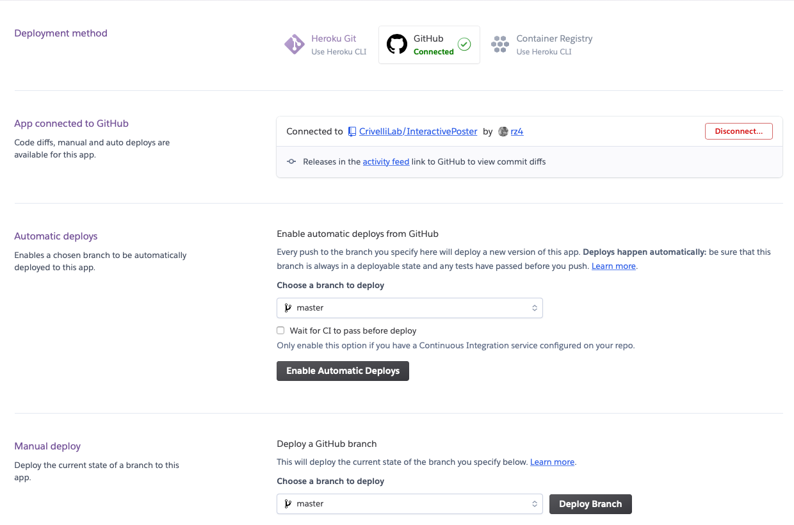

# iPoster: Interactive Poster
The following guide shows how to create and deploy a public
iPoster application using the Heroku platform.
The web application for the poster is implemented using
Flask, Dash, and Plotly.

This is this repo's [example iPoster](https://iposter-template.herokuapp.com/).
The poster layout is formatted to meet WorkForce Development requirements,
and can be exported as a PDF from your web browser.

## Step 1. Fork this Github Repo:
Fork this repo into your Github account using the fork button at the
top of the page. After that, clone your forked repo using the
following command on your terminal.
```bash
git clone [forked-repo-url]
cd [forked-repo]
```

## Step 2. Create a `virtualenv` with required dependencies:
This process assumes you have Python3 and Pip installed.
Run the following Bash script found in the repo to
install the needed python packages.

```bash
source setup_env.sh
```

To load the virtualenv, run the following command.

```bash
source iposter-env/bin/activate
```

## Step 3. Implement your poster using the available tools:
The poster code can be found in `app.py`. There, you will find a function
called `create_poster` which defines the current template used in this guide.

The following gives details on how to create a new poster, make sections, and add figures.
The workflow was simplified to be define the poster in a linear way to
prevent overly complex nested layouts which is standard in Dash.

### Step 3.a. Create a new iPoster instance:
`iPoster` and `colors` is already imported in `app.py`. Set all required
fields including poster title, authors in desired order, and logo.

The logo of your home institution should be set to an image saved under `assets/`, and for the
time being, is best presented for logos with a 1:1 height to width ratios.

```python
# Create an iPoster
my_poster = iPoster(title="Research poster title; state the main topic of your study", # Title of your poster
                    authors_dict={"Inter Name" : "University Name", # Authors in {student, mentors, PI} order
                                  "Researcher Name" : "University Name",
                                  "Mentor (Primary Investigator) Name" : "Lawrence Berkeley National Laboratory"},
                    logo = "hood.png", # Home institution logo
                    banner_color=colors.DOE_GREEN, # Color of banner header; colors has preset colors
                    text_color=colors.WHITE)

```

### Step 3.b. Add a new Section:
When iPoster is instantiated, a new poster column is also created. We can
add sections to the column using the `.add_section` method. Sections will
fill the column in a fluid fashion unless an explicit `height` parameter
is provided. `height` can be set in inches.

```python
my_poster.add_section(title="Abstract", # Section Title
                      text="The first cell of your Research Poster must include your research abstract in its entirety. \
                      The abstract should fully summarize the contents of your Research Paper in one paragraph. For \
                      detailed instructions about how to write the abstract, read Chapter 14 of Scientific Writing\
                      and Communication.", # Text body of the section
                      color=colors.HOOD_BLUE, # Section header color
                      height="5in") # Static height is applicable; Use this for bottom sections to fill in empty space.
```

### Step 3.c. Section with Image:
You can add a static image to a section by filling out the
`img` parameter in `add_section`. `img` must be set to a dictionary with the
following 4 keys: `"filename"`, `"height"`, `"width"`, `"caption"`.

Place your image files under `assets/` in the project directory. This will
make those images visible to the Dash application. After that, `filename`
can be set to the name of the image file. `caption` should be set to
give your image a figure caption.

The code manages figure numbering so you don't need to worry about that.

```python
my_poster.add_section(title="Images",
                      text="Save your image in the assets directory and set img to the filename.",
                      img={"filename":"test.png", "height":"6in", "width":"8in", "caption":"Text for figure caption."})
```

### Step 3.d. Section with Interactive Plot:
Dash integrates cleanly with plots created in Plotly. You can use this to
create interesting interactive plots. You can add a plotly graph by
setting the `plot` argument in `add_section` to a dictionary
with the following 2 keys: `"fig"` and `"caption"`.

`fig` will be set to your plot, and `caption` to its corresponding figure
caption.

```python
from plotly.express import bar
import pandas as pd
df = pd.DataFrame([[i,i] for i in range(100)], columns=["x","y"])
my_plot = bar(df, "x", "y")
my_poster.add_section(title="Plots",
                      text="You can add interactive plots through plotly.",
                      plot={"fig": my_plot, "caption":"interactive plot figure caption"})
```

### Step 3.e. Section with Custom Dash Layouts:
If you find the current options limiting your creativity, you can pass
in your own Dash layout through the `children` parameter in `.add_section`.
This appends your layout to the rest of the elements you've decided to include.


### Step 3.f. Add a new Column:
Once you've add all the sections to the initial column,
move on to the next column by calling `next_column`. There's no limit on the
number of columns, but columns will fit relative to the space on the poster.

```python
my_poster.next_column()
```

### Step 3.g. Return the compiled iPoster:
At the end of the `create_poster` function, return the compiled version
of the poster. Calling `.compile` will return the final poster's Dash layout.

```python
return my_poster.compile()
```

## Step 4. Run your iPoster locally:
To make sure that your poster looks like you want it before deploying it
using Heroku, run the poster application locally. First change the
`RUN_LOCAL` flag in the `app.py` file to `True`.

```python
# file: app.py

#*** Run Local Flag ***
RUN_LOCAL=True
```

After this, run the dash application. Copy and paste the URL listed on the
terminal output.

```bash
$ python3 app.py
```

## Step 4. Deploy your iPoster on Heroku:

### Step 4.a. Create a free Heroku account:
[Account Signup](https://signup.heroku.com)

### Step 4.b. Create a new app:
After you log in to your Heroku app, click `Create a New App`.
Your application name will be the url domain.

### Step 4.c. Update the poster QRCode with the new app name:
Change the `POSTERURL` in `generate_qrcode.sh` to your application name from the
previous step.

```bash
POSTERURL=iposter-template

# Create QRCode
python iposter/qrcode.py $POSTERURL
```

After you change it, run the bash script.

```bash
source generate_qrcode.sh
```

### Step 4.d. Change `RUN_LOCAL` to `False`:
If `RUN_LOCAL` in `app.py` is still set to `True`, change it to `False` before moving
on to the next steps. You will get an error when deploying otherwise.

### Step 4.e. Export `virtaulenv`:
If you installed any other python packages for your poster,
run the following command to update your requirements file. This
assumes your virtaulenv is activated.

```bash
pip freeze > requirements.txt

```
### Step 4.f. Push all your changes to Github:
Push all your changes to Github using the following commands.

```bash
git add *
git commit -m "Latest"
git push
```

### Step 4.g. Deploy your iPoster app:
After your changes have been pushed, go back to Heroku and
select the `Deploy` tab and link your Github account under
`Connect to Github`. Once you've linked your account, you can search for your repo
under the same section.



Select your repo, scroll down, and run a manual deployment of the application
by clicking on `Deploy Branch`. This may take a few minutes. Once it's done,
Heroku will give you a link to view your app.
